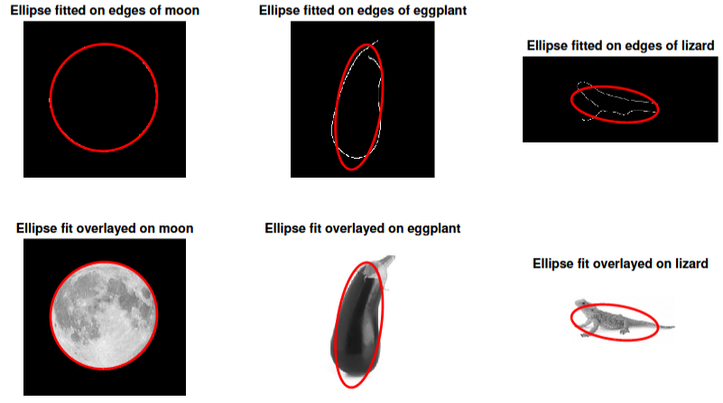

# Fitting ellipse edges on object using optimization theory

The digital processing of images is of key importance in many engineering problems where automated diagnostics,
 detection, object recognition, image enhancement, encoding or classification of objects in a digital image is the
 main purpose. This purpose is achieved by parsing a digital image as input data through an algorithm, often in real
 time applications. This project focuses on the detection and classification of objects in an image. This problem
 amounts to finding and identifying one or multiple specific objects in an image or in a sequence of images.

 The project is divided into three main parts, (1) Parametrization of ellipses, (2) Feature extraction, we extract the edge feature of the given images, (3) Ellipses fitting, we fit the ellipse on the edge feature of the image.

## Result of ellipses fitting algorithm
For more details, please refer to the [report](./report.pdf).
